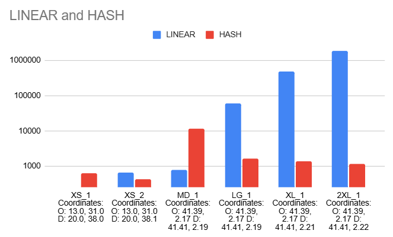
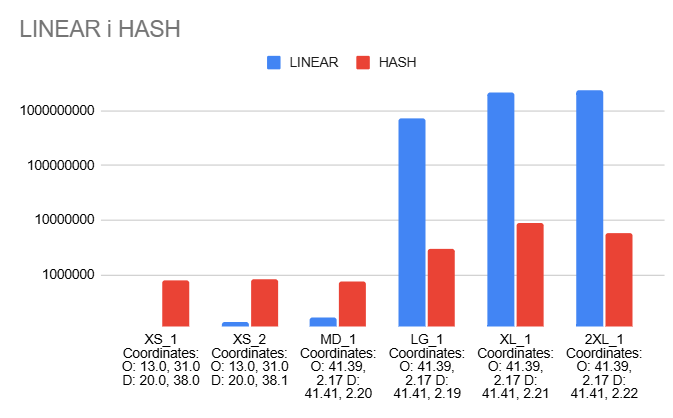
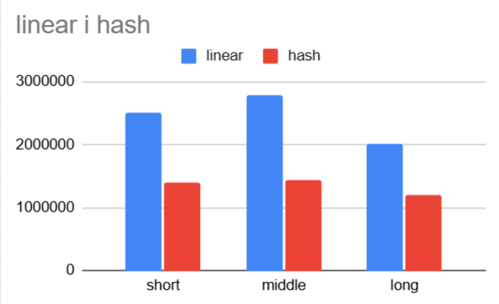

# Performance analysis

This document summarizes measurements made by Xavier Montaner, Albert Gummà and Víctor Murillo during the original university project.

## Intersection lookup

Street segments were first connected by scanning the complete linked list and later through a fixed-size hash map keyed by intersection ID.

| Map | Sequential lookup (ns) | Hash-map lookup (ns) |
| --- | ---: | ---: |
| xs_1 | 250 | 625 |
| xs_2 | 650 | 425 |
| md_1 | 775 | 11,700 |
| lg_1 | 59,469 | 1,652 |
| xl_1 | 475,564 | 1,405 |
| 2xl_1 | 1,818,357 | 1,153 |

Sequential lookup is competitive for tiny maps, but its latency grows sharply with the dataset. Hash lookup has additional fixed overhead and an expected average lookup cost of O(1), although collisions can degrade performance.

## Breadth-first search

| Map | Sequential BFS (ns) | Hash-map BFS (ns) |
| --- | ---: | ---: |
| xs_1 | 113,050 | 794,000 |
| xs_2 | 137,125 | 835,000 |
| md_1 | 168,475 | 771,750 |
| lg_1 | 712,273,750 | 3,039,575 |
| xl_1 | 2,199,386,575 | 8,957,500 |
| 2xl_1 | 2,372,062,725 | 5,749,200 |

The sequential implementation repeatedly scans all street segments to find outgoing connections. On large datasets that extra scan dominates traversal time. The hash-based graph allows expected O(1) adjacency lookup and brings BFS closer to its standard O(V + E) behavior.

## Limitations

- Measurements were taken from a small number of executions and should be treated as exploratory rather than statistically rigorous benchmarks.
- Map topology and destination position affect how much of the graph BFS explores.
- Dataset parsing and graph construction should be measured separately from route search.
- The fixed-size hash tables should be resized dynamically for consistently large datasets.
- The nearest-street query remains a linear scan; a spatial index would improve it substantially.

